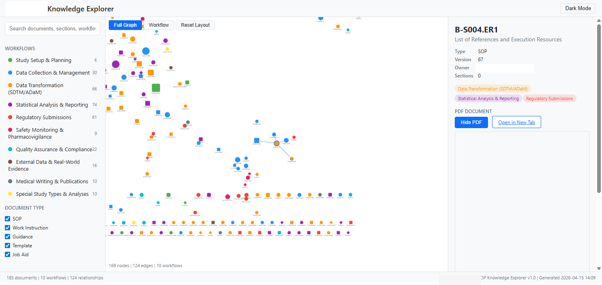

# sop-knowledge-graph

A six-stage automated pipeline that transforms pharmaceutical Standard Operating Procedures (SOPs) into a structured knowledge graph, workflow-organized eBook, and interactive web explorer.

> **Paper**: Yan, J. (2026). Automated Knowledge Extraction and Organization of Pharmaceutical Standard Operating Procedures: A Six-Stage Pipeline Approach. *Journal of the Society for Clinical Data Management (JSCDM)*. (Submitted)

## Architecture

```
┌──────────────┐     ┌──────────────┐     ┌──────────────┐
│  Stage 1     │     │  Stage 2     │     │  Stage 3     │
│  Content     │────>│  Workflow    │────>│  Knowledge   │
│  Extraction  │     │  Mapping     │     │  Graph       │
│  (.docx/.pdf │     │  (taxonomy + │     │  (JSONL,     │
│   -> UDM)    │     │   keywords)  │     │   JSON-LD)   │
└──────────────┘     └──────────────┘     └──────────────┘
       │                                         │
       v                                         v
┌──────────────┐     ┌──────────────┐     ┌──────────────┐
│  Stage 4     │     │  Stage 5     │     │  Stage 6     │
│  PDF eBook   │     │  Agent Skill │     │  Interactive │
│  (workflow-  │     │  Package     │     │  Explorer    │
│   organized) │     │  (LLM-ready) │     │  (HTML+JS)   │
└──────────────┘     └──────────────┘     └──────────────┘
```

## Production Results

The pipeline was validated on a corpus of 253 pharmaceutical SOPs from a large organization's biostatistics division.

| Metric | Value |
|--------|-------|
| Documents scanned | 253 supported + 16 legacy .doc converted |
| Unique documents extracted | 185 |
| Extraction errors | 0 |
| Workflow assignments | 470 across 10 lifecycles |
| Manual overrides applied | 83 |
| Relationship edges | 439 |
| eBook output | 51.8 MB, 6,620 pages |
| Interactive explorer | 559 KB self-contained HTML |

### Workflow Distribution

| Workflow | Documents | Description |
|----------|-----------|-------------|
| Statistical Analysis & Reporting | 74 | TLFs, SAPs, programming |
| Data Transformation (SDTM/ADaM) | 66 | CDISC datasets, standards |
| Regulatory Submissions | 61 | eSub, IND/BLA/NDA |
| Data Collection & Management | 30 | EDC, queries, DB lock |
| Quality Assurance & Compliance | 22 | Audits, GxP, validation |
| External Data & Real-World Evidence | 16 | RWE, epidemiology |
| Medical Writing & Publications | 10 | CSR, IB, narratives |
| Special Study Types & Analyses | 10 | Oncology, PK/PD, HTA |
| Safety Monitoring & Pharmacovigilance | 9 | AE reporting, DMC |
| Study Setup & Planning | 6 | Protocols, kickoff |

### Interactive Knowledge Explorer



*The explorer renders 169 graph nodes and 124 cross-reference edges in a self-contained 559 KB HTML file. Nodes are color-coded by workflow and shaped by document type (ellipse = SOP, rectangle = Work Instruction, diamond = Template).*

## Pipeline Stages

### Stage 1: Content Extraction (`content_extractor.py`)
Parses `.docx` and `.pdf` documents into a Unified Document Model (UDM) containing metadata, section hierarchy, procedure steps, tables, templates, and cross-references.

### Stage 2: Workflow Mapping (`workflow_mapper.py`)
Assigns each document to one or more of 10 lifecycle-based workflows using keyword scoring against a configurable taxonomy. Supports manual overrides for domain expert corrections.

### Stage 3: Knowledge Graph (`knowledge_graph_builder.py`)
Generates four output formats from UDM + workflow mappings:
- **JSONL** — streaming format for large-scale ingestion
- **Hierarchical JSON** — per-workflow files for selective loading
- **JSON-LD** — graph database ready (Neo4j, RDF stores)
- **Index** — fast lookup metadata for progressive loading

### Stage 4: PDF eBook (`ebook_builder.py`)
Compiles all SOPs into a workflow-organized PDF eBook with auto-generated cover, table of contents, chapter dividers, and cross-reference hyperlinks.

### Stage 5: Agent Skill Package
Packages the knowledge graph into an LLM-consumable skill format for AI-assisted SOP navigation.

### Stage 6: Interactive Explorer (`explorer_builder.py`)
Generates a self-contained HTML file with Cytoscape.js graph visualization, full-text search, workflow filtering, and embedded PDF preview.

## Technology Stack

| Component | Technology |
|-----------|------------|
| Document parsing | python-docx, PyMuPDF, pdfplumber |
| Legacy .doc conversion | pywin32 (Word COM automation) |
| PDF generation | PyMuPDF (ReportLab-free) |
| Graph visualization | Cytoscape.js 3.33 |
| Reactive UI | Alpine.js 3.15 |
| HTML templating | Jinja2 |
| Configuration | PyYAML + python-dotenv |

## Setup

```bash
# Clone
git clone https://github.com/YOUR_USERNAME/sop-knowledge-graph.git
cd sop-knowledge-graph

# Install dependencies
pip install -r requirements.txt

# Configure
cp config/config.yaml.example config/config.yaml
# Edit config.yaml with your paths and settings
```

## Usage

```python
from src.content_extractor import extract_document, save_udm
from src.workflow_mapper import map_documents_to_workflows, save_workflow_mappings
from src.knowledge_graph_builder import build_knowledge_graph
from src.explorer_builder import build_explorer

# Stage 1: Extract documents
udm = extract_document("path/to/SOP-001.docx")
save_udm(udm, "output/udm/SOP-001.json")

# Stage 2: Map to workflows
mappings = map_documents_to_workflows(
    udm_files=list(Path("output/udm").glob("*.json")),
    taxonomy_path="config/workflow_taxonomy.yaml",
    overrides_path="config/workflow_overrides.yaml",
)
save_workflow_mappings(mappings, "output/workflow_mappings.json")

# Stage 3: Build knowledge graph
build_knowledge_graph("output/udm", "output/workflow_mappings.json", "output")

# Stage 6: Generate explorer
build_explorer(
    kg_dir=Path("output/knowledge_graph"),
    rel_file=Path("output/relationships.json"),
    udm_dir=Path("output/udm"),
    pdf_dir=Path("output/pdf_renditions"),
    out_dir=Path("output/explorer"),
)
```

## Project Structure

```
sop-knowledge-graph/
├── config/
│   ├── config.yaml.example      # Configuration template
│   └── workflow_taxonomy.yaml   # 10 lifecycle workflows with keywords
├── src/
│   ├── content_extractor.py     # Stage 1: UDM extraction
│   ├── workflow_mapper.py       # Stage 2: Taxonomy mapping
│   ├── knowledge_graph_builder.py  # Stage 3: Multi-format KG
│   ├── ebook_builder.py         # Stage 4: PDF/EPUB eBook
│   ├── doc_converter.py         # Legacy .doc conversion
│   ├── explorer_builder.py      # Stage 6: HTML explorer
│   ├── explorer_template.html   # Jinja2 template for explorer
│   └── utils.py                 # Config loading, logging
├── docs/
│   └── figures/                 # Screenshots and diagrams
├── requirements.txt
├── LICENSE                      # MIT
└── README.md
```

## Citation

If you use this pipeline in your research, please cite:

```bibtex
@article{yan2026sop,
  title   = {Automated Knowledge Extraction and Organization of Pharmaceutical
             Standard Operating Procedures: A Six-Stage Pipeline Approach},
  author  = {Yan, Jaime},
  journal = {Journal of the Society for Clinical Data Management},
  year    = {2026},
  note    = {Submitted}
}
```

## License

MIT License. See [LICENSE](LICENSE) for details.

## Data Availability

Input SOP documents are excluded from this repository due to proprietary restrictions. The pipeline source code, workflow taxonomy, and explorer template are fully provided. To reproduce results, supply your own `.docx`/`.pdf` SOP documents in the configured source directory.
